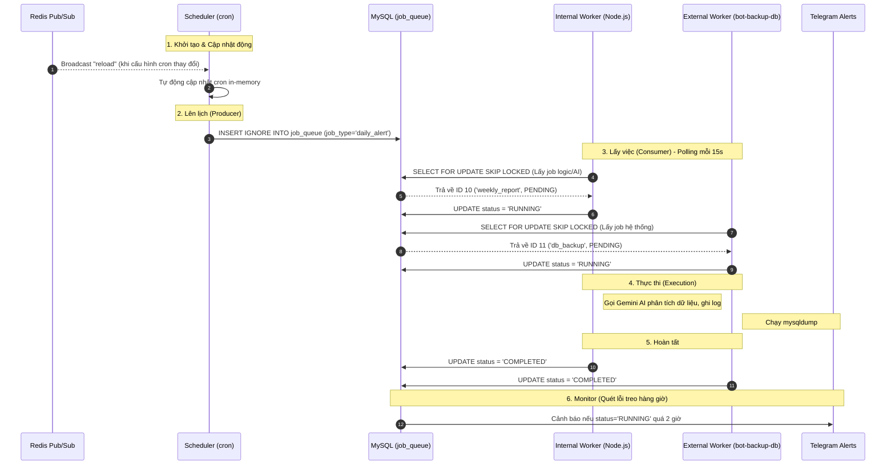

# Kiến trúc System Background Jobs & Queue (FinTra)

Tài liệu này mô tả chuyên sâu về kiến trúc hệ thống xử lý tác vụ nền (background jobs) của FinTra. Hệ thống được thiết kế theo mô hình **Database-backed Task Queue** với khả năng an toàn trong môi trường đa máy chủ (multi-instance/distributed) và phân tách hoàn toàn giữa luồng lên lịch (Scheduling) và luồng thực thi (Execution).

---

## 1. Vấn đề cốt lõi & Phương án thiết kế

### 1.1 Vấn đề
- **Thắt cổ chai luồng chính (Main thread blocking):** Node.js chạy đơn luồng (single-threaded). Nếu các tác vụ nặng như gọi API Gemini AI (`weekly_report`) hoặc backup DB (`mysqldump`) chạy trực tiếp trên process phục vụ HTTP Request, nó sẽ làm chậm hoặc gây timeout cho các request của user.
- **Race conditions (Xung đột đa máy chủ):** Khi scale hệ thống lên nhiều API servers (instances), một cronjob truyền thống sẽ được kích hoạt đồng loạt trên tất cả các server, dẫn đến một user nhận được nhiều báo cáo, hoặc db bị backup nhiều lần cùng một lúc.
- **Quản lý trạng thái & Lỗi:** Các job chạy ẩn khó theo dõi tiến trình (đang chạy, lỗi, hay thành công), thiếu cơ chế cảnh báo khi bị treo (stuck).

### 1.2 Giải pháp kiến trúc
Thiết kế lại toàn bộ hệ thống theo **Producer-Consumer pattern** qua Database Queue:
1. **Producer (Scheduler):** Chỉ làm nhiệm vụ kiểm tra đồng hồ và "đẩy" (enqueue) thẻ công việc vào Database. Hoàn thành trong vài mili-giây.
2. **Queue (MySQL):** Hoạt động như một Broker, lưu trữ trạng thái của từng tác vụ.
3. **Consumer (Workers):** Tách biệt khỏi luồng HTTP, liên tục quét (poll) Queue để nhận việc.

---

## 2. Sơ đồ luồng hoạt động chi tiết (Workflow)



---

## 3. Cấu trúc dữ liệu (Database Schema)

Bảng `job_queue` là trái tim của hệ thống:

```sql
CREATE TABLE job_queue (
  id INT AUTO_INCREMENT PRIMARY KEY,
  job_type VARCHAR(50) NOT NULL,
  status ENUM('PENDING', 'RUNNING', 'COMPLETED', 'FAILED') DEFAULT 'PENDING',
  run_at DATETIME NOT NULL,
  started_at DATETIME NULL,
  completed_at DATETIME NULL,
  error_message TEXT NULL,
  created_at TIMESTAMP DEFAULT CURRENT_TIMESTAMP,
  
  -- Ràng buộc cốt lõi: Ngăn chặn Duplicate cùng 1 loại job trong 1 ngày
  UNIQUE KEY uq_job_type_date (job_type, (DATE(run_at)))
);
```

**Tại sao có `UNIQUE KEY uq_job_type_date`?**
Nếu hệ thống có 3 API servers, vào đúng 22:00, cả 3 server đều cố gắng chạy lệnh `INSERT` job `daily_alert`. Nhờ UNIQUE constraint và lệnh `INSERT IGNORE`, chỉ server đầu tiên chèn thành công, 2 server còn lại sẽ bị bỏ qua một cách an toàn.

---

## 4. Các thành phần hệ thống & Nhiệm vụ (Codebase Mapping)

### 4.1. Scheduler (`services/schedulerService.js`)
- Lấy cron expression từ bảng `scheduler_settings` trong DB.
- Lắng nghe kênh **Redis Pub/Sub (`scheduler_sync`)**. Khi có thay đổi thời gian trên Admin Panel, Redis sẽ phát tín hiệu để TẤT CẢ các instances tự động tải lại lịch cron mà không cần restart server (Zero-downtime reconfiguration).
- Lệnh cron chỉ thực thi hàm `enqueueJob()` siêu nhẹ: `() => enqueueJob('weekly_report')`.

### 4.2. Queue Service (`services/queueService.js`)
- Wrapper tiện ích chứa lệnh SQL `INSERT IGNORE INTO job_queue...`. Đảm bảo code sạch, tập trung xử lý Database write.

### 4.3. Các Queue Workers (Consumers)
Để tối ưu tài nguyên, hệ thống chia làm 2 loại worker:

#### A. Internal Worker (`services/queueWorkerService.js`)
- **Vị trí:** Nằm ngay bên trong backend Express (sử dụng `setInterval`).
- **Nhiệm vụ:** Xử lý `daily_alert` (query DB đơn giản) và `weekly_report` (giao tiếp API Gemini AI).
- **Lý do nội bộ:** Các tác vụ này cần tái sử dụng phần lớn code logic, model dữ liệu, utils cấu hình AI của backend. Vì nó là thao tác I/O mạng (Network I/O), Node.js xử lý bất đồng bộ (async/await) vô cùng hiệu quả, không làm nghẽn Main Event Loop.

#### B. External Worker (Kho lưu trữ độc lập: `bot-backup-db`)
- **Vị trí:** Một process riêng (hoặc docker container riêng).
- **Nhiệm vụ:** Chỉ xử lý `db_backup`.
- **Lý do tách biệt:** Backup database bằng `mysqldump` là thao tác ăn sâu vào CPU và Disk I/O (OS-level task). Nếu chạy chung với backend, nó có thể làm chậm trầm trọng các API đang phục vụ user lúc đó.

### 4.4. Queue Monitor (`services/queueMonitorService.js`)
- Hoạt động như một "Watchdog". Chạy mỗi giờ một lần.
- **Dead-letter Handler:** Nếu một job kẹt ở trạng thái `RUNNING` vượt quá 2 giờ (có thể do worker bị crash RAM giữa chừng, mất điện, v.v.), Monitor sẽ reset trạng thái thành `FAILED` với log "Timeout".
- Gửi thông báo khẩn cấp (Alert) trực tiếp vào Telegram của các Admins thông qua `ADMIN_USER_IDS`.

---

## 5. Kỹ thuật chống "Tranh Chấp" (Concurrency Control)

Kỹ thuật quan trọng nhất của Worker là cách lấy việc ra khỏi Queue mà không bị giành giật giữa nhiều tiến trình:

```sql
SELECT id, job_type FROM job_queue
WHERE status = 'PENDING' AND run_at <= NOW()
LIMIT 1 
FOR UPDATE SKIP LOCKED;
```

**Cơ chế hoạt động:**
- `FOR UPDATE`: Yêu cầu MySQL khóa (lock) record này lại ngay khi SELECT, các giao dịch (transaction) khác không thể SELECT nó để sửa đổi.
- `SKIP LOCKED`: Rất quan trọng! Nếu Record A đã bị Worker 1 khóa, Worker 2 khi chạy lệnh SELECT sẽ **bỏ qua Record A** và lập tức lấy Record B thay vì phải đứng chờ Worker 1 nhả khóa.
- Nhờ vậy, hàng chục worker có thể lấy job từ queue cực nhanh mà không bị thắt nút cổ chai (deadlock) hay chặn nhau.

---

## 6. Hướng dẫn thêm một Job mới

Quy trình chuẩn khi có một yêu cầu tính năng chạy ngầm mới:

1. **Định nghĩa Business Logic:**
   - Viết hàm xử lý trong service tương ứng. Ví dụ: `services/marketingService.js` có hàm `sendMonthlyPromo()`.
2. **Khai báo trong Scheduler (Producer):**
   - Mở `services/schedulerService.js`. Cập nhật biến `JOB_HANDLERS`:
     ```javascript
     const JOB_HANDLERS = {
       monthly_promo: () => enqueueJob('monthly_promo'),
     };
     ```
3. **Đăng ký với Worker (Consumer):**
   - Mở `services/queueWorkerService.js`.
   - Import hàm xử lý và map vào `WORKER_HANDLERS`:
     ```javascript
     const WORKER_HANDLERS = {
       monthly_promo: sendMonthlyPromo,
     };
     ```
   - Cập nhật câu lệnh `SELECT ... IN ('daily_alert', 'weekly_report', 'monthly_promo')`.
4. **Kích hoạt:**
   - Thêm record vào bảng `scheduler_settings` trong MySQL. (Cron sẽ tự động nhận diện qua hệ thống Redis Pub/Sub).

---

## 7. Phân tích điểm ưu việt (Pros)

- **Decoupled Architecture:** Tách rời hoàn toàn Logic Đặt giờ (Cron) và Logic Thực thi.
- **Fail-safe (An toàn khi lỗi):** Lỗi trong quá trình chạy AI (như timeout API) sẽ được bắt (catch) và cập nhật thành `FAILED`, giữ lại toàn bộ `error_message` trong Database để debug.
- **Scalability (Mở rộng dễ dàng):** Nếu lượng User tăng đột biến, việc gọi AI hàng tuần có thể làm Worker nội bộ quá tải. Khi đó, ta chỉ việc tách `queueWorkerService.js` thành một codebase Node.js riêng biệt và nhân bản nó thành nhiều docker containers (N External Workers). Kiến trúc DB Queue hiện tại đã hỗ trợ sẵn sàng việc này mà không cần sửa dòng code cốt lõi nào.
